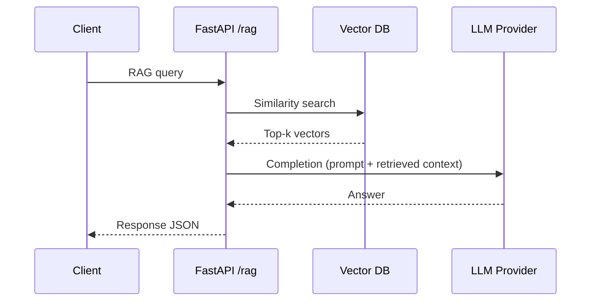

# ADR #1 – Language and Framework Choice: Python + FastAPI

> Status: Accepted (Month 1 baseline) — Reassess at Milestone 2.

## Table of Contents

1. Context
2. Decision
3. Decision Drivers
4. Rationale
5. Alternatives Considered
6. SLOs & Consequences
7. Risks & Triggers
8. Ops & Security Stance
9. Migration Path Checklist
10. Appendix

## 1. Context

The *AI Investment Agent v1.0* requires a minimal, fast-to-develop backend for experimenting with AI pipelines (LLM calls, vector DB, async orchestration). The backend must support:

* Asynchronous I/O for LLM and vector DB calls
* Easy integration with Python AI libraries (LangChain, Hugging Face, OpenAI SDK)
* Lightweight deployment for iterative prototyping

## 2. Decision

Adopt Python as the primary backend language and FastAPI as the web framework.

## 3. Decision Drivers (Weighted)

| Driver | Weight | Justification |
| ------ | ------ | ------------- |
| Time-to-first-demo | 40% | Stakeholder validation requires rapid iteration and minimal boilerplate. |
| AI library breadth | 30% | Access to embeddings, model SDKs, and RAG tooling drives experimentation velocity. |
| Operability & Observability | 20% | Simple logging/tracing reduces MTTR early. |
| Cost efficiency | 10% | Avoid premature optimization; keep infra minimal initially. |

## 4. Rationale

| Requirement                  | Why Python + FastAPI fits                                                       |
| ---------------------------- | ------------------------------------------------------------------------------- |
| AI ecosystem                 | Python has native SDKs for all major AI frameworks and APIs.                    |
| Asynchronous support         | FastAPI supports `async/await` by design, crucial for concurrent API calls.     |
| Developer velocity           | Concise syntax, hot reload, and built-in schema validation via Pydantic.        |
| Performance                  | Comparable to Node.js for I/O-heavy workloads; backed by `uvicorn` (ASGI).      |
| Typing & maintainability     | Python 3.12+ typing + Pydantic ensure robustness in medium to large codebases.  |
| Deployment                   | Compatible with Docker, Cloud Run, and serverless patterns with minimal config. |

## 5. Alternatives Considered

* Go + Fiber / Gin: Strong raw performance and low memory usage. Downsides: smaller AI-focused ecosystem, fewer high-level LLM orchestration libraries, slower experimentation vs Python.
* Node.js + Express / Fastify: Good async story and large community. Downsides: weaker type safety unless using TypeScript rigorously; ecosystem for deep AI (model fine-tuning, embeddings) is Python‑first.
* Spring Boot (Java): Highly mature, rich tooling. Downsides: heavy startup and cognitive overhead for early prototyping; slower iteration for small AI experiments.
* Rust + Axum: Excellent performance and safety. Downsides: steep learning curve, limited high-level AI libs, slower initial velocity.

## 6. SLOs & Consequences

### Service Level Objectives (Initial)

| Use Case | Metric | Target | Notes / Assumptions |
| -------- | ------ | ------ | ------------------- |
| Echo / health endpoint | p95 latency | ≤ 300 ms | Single region, warm process, small response. |
| Basic RAG query (vector lookup + 1 LLM call) | p95 latency | ≤ 1.5 s | Assumes cached embeddings + single OpenAI completion. |
| API error rate | Error % | < 1% | Rolling 7-day window; excludes client 4xx. |
| Availability | Uptime | ≥ 99% | Single instance acceptable; health checks every 30s. |

If p95 latency exceeds targets for 7 straight days or sustained QPS > 50 on `/ask` or future `/rag`, initiate scaling review.

### Pros

* Rapid prototyping speed and minimal boilerplate.
* Rich AI and data science ecosystem (OpenAI, Hugging Face, LangChain compatibility).
* Native async enabling higher throughput for I/O-bound calls.

### Cons

* Lower raw performance vs Go/Rust for CPU-bound tasks.
* Higher memory footprint may limit ultra high-density deployments.
* Cold start slower in some serverless environments (compared to Go/Rust).

### Mitigations / Future Path

* Offload heavy CPU-bound or streaming components to microservices written in Go/Rust at later scaling milestone.
* Apply profiling + async tuning (uvicorn workers, event loop config) before introducing more complexity.
* Consider a polyglot architecture only after validating product-market fit / usage patterns.

## 7. Risks & Triggers

| Risk | Impact | Mitigation | Trigger to Revisit |
| ---- | ------ | ---------- | ------------------ |
| Serverless cold starts (future deployment) | Elevated p95 latency | Prefer container-based always-on for early phase | Cold start adds >400 ms on >20% of requests |
| Blocking CPU-bound operations creeping in | Event loop starvation | Profile and isolate heavy tasks | Event loop blocking >100 ms in traces |
| Vendor lock-in (LLM API) | Reduced portability | Abstract LLM via service layer | Feature requires unsupported provider |
| Secrets leakage via logs | Security incident | Structured logging excludes secrets | Audit finds sensitive value logged |

## 8. Ops & Security Stance (Initial)

| Area | Standard |
| ---- | -------- |
| Logging | Structured JSON (evolve Loguru -> structured logger) with request IDs & trace/span IDs |
| Tracing | Prepare for OpenTelemetry instrumentation (HTTP middleware + LLM calls) |
| Secrets Management | Env vars + future Vault/KMS; no secrets in images |
| Python Version | Min Python 3.12; Pydantic v2.x pinned |
| Dependency Hygiene | `poetry export` SBOM draft; periodic `pip-audit` |
| Access Control | None (internal dev); API key / token auth by Month 2 |

## 9. Migration Path Checklist (Future Extraction)

1. Profile & identify CPU‑bound / high‑throughput hot path.
2. Define boundary (function + data contracts).
3. Choose gRPC (protobuf) or HTTP+JSON contract; document schema.
4. Implement minimal Go/Rust service with load test harness.
5. Benchmark vs Python (identical dataset/QPS).
6. Add circuit breaker + retries in Python client.
7. Shadow traffic → 10% → 50% → 100% rollout.
8. Update ADR & ops runbook.

## 10. Appendix

### Quickstart


```bash
poetry install
poetry run uvicorn main:app --reload --port 8000
curl http://127.0.0.1:8000/health
```

### Dependency Pins (Core)

| Package | Version (approx) |
| ------- | ---------------- |
| fastapi | 0.119.x |
| uvicorn | 0.37.x |
| pydantic-settings | 2.11.x |
| openai | 2.6.x |
| loguru | (dev) |
| locust | (dev) |

### Simplified Sequence (RAG Query Prototype)



### Future Enhancements

* Replace ad-hoc logging with structured JSON + OpenTelemetry traces.
* Introduce rate limiting + auth keys.
* Add synthetic monitoring for SLO validation.
