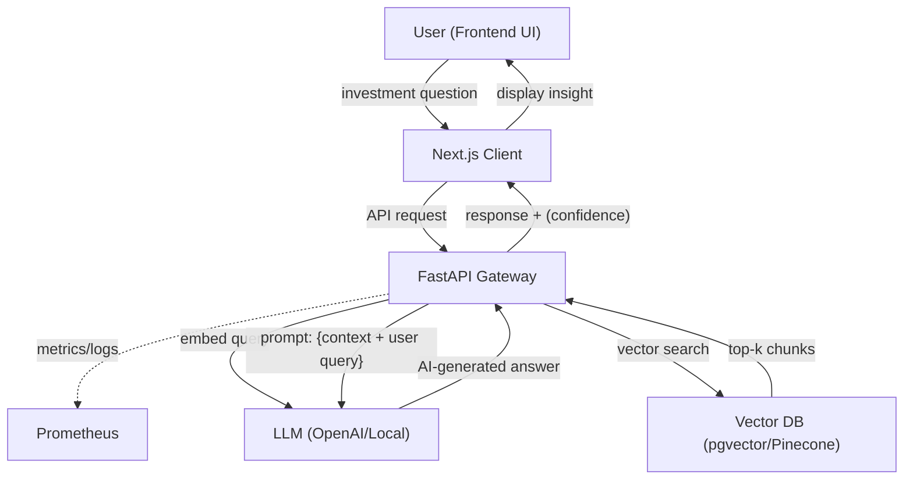

# ADR #2 – RAG Design Choice

> Status: Proposed (Month 1, Week 2)

## Table of Contents

1. Context
2. Decision
3. Architecture Snippet
4. Alternatives Considered
5. Consequences
6. Observability & Metrics
7. Appendix

## 1. Context

To ground LLM answers in factual, up-to-date data, we use Retrieval-Augmented Generation (RAG). This approach enables the system to ingest documents, chunk and embed them, store vectors in a vector DB, and retrieve relevant context for LLM completions. The pipeline ensures answers are based on stored knowledge, not just model pretraining.

**End-to-End User Flow:**



**Flow Description:**

- User enters a question in the frontend UI (Next.js).
- Next.js sends the query to the FastAPI backend.
- FastAPI logs the request and timing metrics.
- The backend embeds the query and runs a vector similarity search in the Vector DB.
- Retrieved chunks are combined with the user query to form the LLM prompt.
- The LLM generates a response (optionally with a confidence score).
- The response is returned to the frontend and displayed to the user.

## 2. Decision

Adopt a modular RAG pipeline using embeddings and vector search (pgvector or Pinecone):

- Ingest documents, chunk and embed them (local or OpenAI model).
- Store embeddings in a vector DB (PostgreSQL+pgvector or Pinecone).
- On user query, embed the query and retrieve top-k similar chunks.
- Compose LLM prompt with retrieved context for factual, grounded answers.

## 3. Architecture Snippet

```
[User Query] → [FastAPI Backend] → [Vector DB Search] → [Top-k Chunks] → [LLM Completion]
```

## 4. Alternatives Considered

- **Fine-tuning LLMs:**
  - Pros: Model learns domain-specific knowledge.
  - Cons: Costly, slow iteration, less flexible for new data. RAG is preferred for its ability to update knowledge instantly and avoid expensive retraining.
- **Hybrid Search (BM25 + Dense Embeddings):**
  - Pros: Combines lexical and semantic search for better recall.
  - Cons: More complex, requires additional infrastructure.

## Rationale

- **Why RAG instead of fine-tuning:** RAG allows the system to incorporate new information without retraining the LLM, reducing cost and increasing agility. Fine-tuning is slower and less flexible for evolving data sources.
- **Why pgvector over Pinecone:** pgvector is open-source, self-hosted, and offers local control over data and costs. Pinecone is a managed service, which may be preferable for scale but introduces vendor lock-in and ongoing costs.
- **Chunking and embedding model choices:** Chunking is performed to optimize retrieval granularity and context relevance. Embedding models are chosen based on accuracy, cost, and compatibility (OpenAI or local models).
- **Retrieval query type:** Cosine similarity and top-k retrieval are used for efficient and relevant context selection from the vector database.

## 5. Consequences

The RAG design has several consequences:

**Pros:**
- Factual accuracy, lower hallucination risk.
- Modular retraining and data updates.
- Scalable and extensible architecture.

**Cons:**
- Extra latency (embedding, vector search).
- Vector DB management overhead.
- Embedding costs (if using API).

## 6. Observability & Metrics (Updated)

The stack uses OpenTelemetry for metrics and tracing, scraped by Prometheus and visualized in Grafana and Jaeger.

- JSON structured logs (`logs/app.log`, weekly rotation) include: `req_id`, `route`, `latency_ms`, `status`, `trace_id`, and optional domain fields (e.g. `retrieved_doc_ids`).

- Log retention: 1 week rotation (can be extended later via external log sink).

| Name | Type | Description |
|------|------|-------------|
| `ai_query_time_seconds` | Histogram | End-to-end `/ai/query` latency. |
| `ai_retrieval_latency_seconds` | Histogram | Vector similarity search duration. |
| `ai_llm_query_time_seconds` | Histogram | LLM call latency. |
| `ai_llm_tokens_total` | Counter | Total LLM tokens (prompt + completion) consumed. |
| `api_search_requests_total` | Counter | Number of `/documents/search` calls. |
| `embedding_failures_total` | Counter | Embedding errors encountered. |

Future (not yet implemented):

## 7. Evaluation Metrics

To assess the effectiveness and efficiency of the RAG pipeline, the following evaluation metrics are tracked:

- **Relevance Score:** Measures how well retrieved context matches the user query, based on similarity and LLM output quality.
- **Latency:** Tracks end-to-end response time, as well as breakdowns for retrieval and LLM completion.
- **Cost per Query:** Estimates the computational and API costs for each query, including embedding and LLM usage.

These metrics inform ongoing improvements to retrieval quality, system performance, and cost management.

| Proposed | Type | Rationale |
|----------|------|-----------|
| `rag_queries_total{status}` | Counter | Success/error classification of RAG calls. |
| `inflight_requests` | Gauge | Concurrent active requests (load shedding insights). |
| `vector_db_pool_in_use` | Gauge | Connection pool usage for capacity planning. |
| `tokens_prompt_total` / `tokens_completion_total` | Counters | Split token accounting. |

### Tracing (OpenTelemetry → Jaeger)

Span hierarchy for `/ai/query`:

```text
ai.query (root)
  ├─ embedding.query
  ├─ retrieval.vector_search
  └─ llm.call
```

Key span attributes:

- `question.length`
- `retrieval.top_k`, `retrieval.result_count`
- `sources.count`
- `llm.prompt.length`
- `query.duration.seconds`

Correlation: `trace_id` is injected into each request log for pivoting between logs ↔ traces.

### Sampling Policy

- Current: 100% (default TracerProvider) for early development to maximize insight.
- Planned: Switch to ratio-based parent sampling (e.g. 10–20%) in production; always sample error spans.

### Reliability Features

- Embedding & vector DB operations use `tenacity` retries.
- Failures can later increment dedicated `*_error_total` counters (planned Task 5).

### Grafana & Jaeger

- Metrics dashboard: latency percentiles (p50/p95), token consumption trends.
- Jaeger UI at `http://localhost:16686` for span drill-down.

This observability layer enables rapid diagnosis of latency sources (retrieval vs LLM) and capacity planning.

## 8. Next Steps

Planned improvements and future milestones:

- **Multi-agent orchestration:** Introduce agent-based coordination for more complex workflows and decision-making (Month 2).
- **Monitoring for retrieval quality:** Integrate additional metrics and dashboards to track context relevance and system health.
- **Endpoint expansion:** Implement `/ingest` and `/search` endpoints for document management and advanced retrieval.
- **Capacity planning:** Use metrics and tracing to inform scaling and resource allocation.

## 9. Appendix

- See also: ADR #1 (Language and Framework Choice)
- Updated: [Month 1, Week 3, Day 5]
