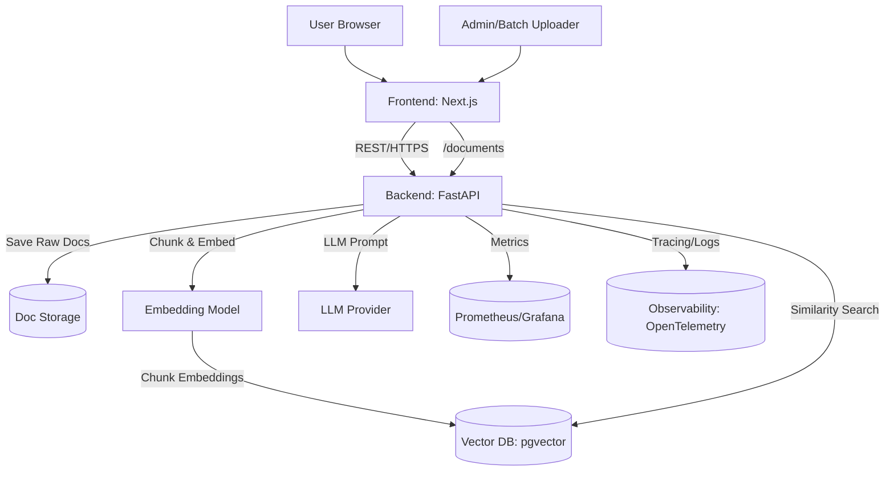

# AI Investment Agent v1.0 — System Architecture Diagram (with Ingestion)

## Mermaid Diagram

## Annotations & Responsibilities

- **Frontend (Next.js):** User input, renders answer, shows citations. Calls backend API. Supports document upload.
- **Admin/Batch Uploader:** Can upload documents for ingestion.
- **Backend (FastAPI):** Orchestrates embed → retrieve → prompt → respond. Handles metrics, logging, and tracing. Manages document ingestion.
- **Doc Storage:** Stores original documents and metadata.
- **Embedding Model:** Converts query and document chunks to vectors.
- **Vector DB (pgvector):** Stores chunk embeddings and supports similarity search.
- **LLM Provider:** Generates answer from context.
- **Monitoring:** Prometheus scrapes metrics, Grafana dashboards.
- **Observability:** Logs, traces, request IDs (OpenTelemetry).

## Integration Boundaries

- API–DB: SQL/pgvector or REST
- API–LLM: OpenAI/HF API
- API–Frontend: REST/HTTPS
- API–Doc Storage: Internal or S3/minio

## Data Flow

### Query Flow

1. User submits query (Frontend → Backend)
2. Backend embeds query (Embedding Model)
3. Backend retrieves context (Vector DB)
4. Backend prompts LLM (LLM Provider)
5. Backend returns answer (Backend → Frontend)
6. Monitoring and observability run throughout

### Ingestion Flow

1. User/admin uploads document (Frontend → Backend `/documents`)
2. Backend saves raw doc (Doc Storage)
3. Backend chunks and embeds (Embedding Model)
4. Stores chunks/embeddings in Vector DB

## Scaling Concerns

- Embedding, Vector DB, LLM, and Monitoring can be split into separate services as load grows.
- Observability and logging should be centralized for all components.
- Ingestion pipeline can be offloaded to async workers or microservices.

---

*This diagram and description are ready for inclusion in ADR #3 — Scaling Strategy.*
