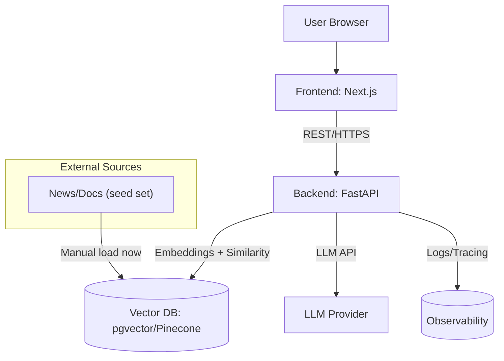

# User Query Component Diagram + Responsibilities

## Diagram

## Components and Responsibilities

- **Frontend: Next.js**
  - Input form, render answer, show citations.
  - Calls `/api/query` and handles errors.
- **Backend: FastAPI (monolith)**
  - Endpoints: `/api/query`, `/health`.
  - Orchestrates embed → retrieve → prompt → respond.
  - Adds latency and usage metrics.
- **Vector DB**
  - Schema: `(id, chunk_text, embedding, source, created_at, score_cache)`.
  - Ops: `upsert(chunks)`, `similarity_search(vec, k)`.
- **LLM Provider**
  - Text completion for Q&A with provided context.
  - Returns answer + token usage.
- **Observability**
  - Structured logs, request IDs, basic timing.
  - Optional: OpenTelemetry exporter.

## Interfaces

- Frontend → Backend: `POST /api/query {query, top_k, sources?}`
- Backend → Vector DB: `similarity_search(vec, k) → [(id, chunk, score, meta)]`
- Backend → LLM: `prompt(context, query) → {answer, usage}`

## Deployment (dev)

- Single Docker Compose file:
  - `web` (Next.js), `api` (FastAPI), `db` (Postgres + pgvector).
- `.env` keys:
  - `OPENAI_API_KEY` or `HF_TOKEN`
  - `DATABASE_URL`, `ALLOWED_ORIGINS`

## Non‑functional targets (dev)

- P50 latency ≤ 2 s, P95 ≤ 6 s.
- 99% uptime during demo.
- Logs for every request with `request_id`.
