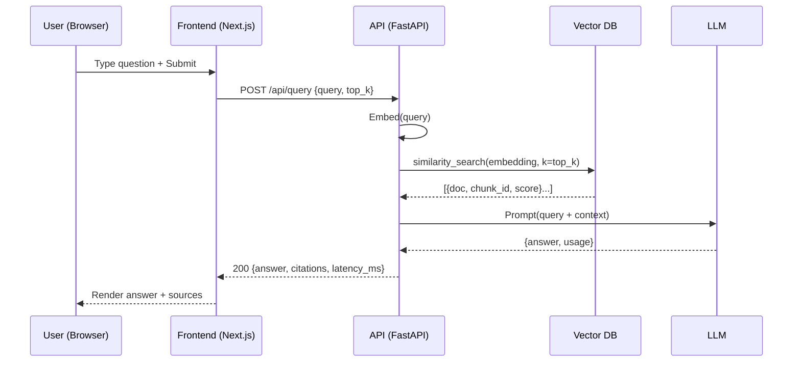

# User Query

## User Flow

1. User enters a question in the **Next.js UI** → clicks Submit.  
2. Next.js sends `POST /api/query` to **FastAPI** with JSON payload.  
3. FastAPI embeds the query → retrieves top-k docs from **vector DB**.  
4. FastAPI builds a prompt with **user query + retrieved context**.  
5. **LLM** returns an answer.  
6. FastAPI returns JSON to Next.js.  
7. Next.js renders **answer and citations**.



## Minimal API Contract

**Request:**

```json
POST /api/query
{
  "query": "string",
  "top_k": 5,
  "sources": ["news","docs"]
}
```

**Response:**

```json
{
  "answer": "string",
  "citations": [
    {"id":"chunk_id","source":"url|doc","score":0.83}
  ],
  "latency_ms": 742,
  "usage": {"prompt_tokens":0,"completion_tokens":0}
}
```

## Error Paths

- 400 invalid payload → `{ "error": "bad_request" }`  
- 502 LLM timeout → `{ "error": "llm_timeout" }`  
- 500 unknown → `{ "error": "internal" }`  

## Acceptance Criteria

- One API that returns an answer for a plain-text query.  
- Response includes **citations array** and **latency**.  
- End-to-end latency ≤ 2 s for cached docs, ≤ 6 s cold.  
